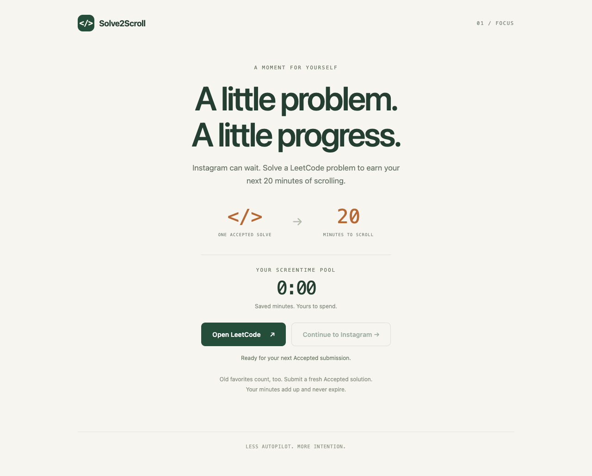

# Solve2Scroll

**One Accepted LeetCode submission. Twenty minutes to scroll.**

A local-first Chrome extension that puts Instagram and TikTok behind a shared screentime pool. Every new Accepted submission earns **20 minutes**, including new submissions to problems you have already solved. Minutes accumulate without a cap or expiration.



## Install

1. Download **[solve2scroll-v0.1.0.zip](https://github.com/reeshabprasa/Solve2Scroll/releases/latest)** from the release assets (not GitHub’s source-code ZIP).
2. Extract it into a permanent folder. Keep this folder: Chrome loads the extension from it.
3. Open `chrome://extensions` in desktop Chrome and enable **Developer mode**.
4. Click **Load unpacked** and select the extracted folder containing `manifest.json`.
5. Pin **Solve2Scroll** from Chrome’s extensions menu.
6. Refresh any LeetCode tabs that were already open. Sign in to LeetCode normally, submit a solution, and wait for **Accepted**.

Your pool starts at **0:00**. The popup shows your balance and verification status. At zero, Instagram and TikTok show the blocked page; after earning time, click **Continue** when you are ready to browse.

Requires Chrome 120 or newer. No server or Chrome Web Store account is needed. Incognito, other profiles, other devices, and native phone apps are outside this version’s scope.

### Updating

Replace the files in the **same extracted folder**, then click **Reload** on the extension card in `chrome://extensions`. Refresh open LeetCode and social tabs. Keep the folder path unchanged so Chrome retains the unpacked extension’s identity and saved pool. Removing/uninstalling the extension deletes its stored data. Downloaded GitHub releases do not update automatically.

## How time works

- Every distinct, newly observed Accepted submission ID earns **1,200 seconds**. Submitting the same problem again with a new ID counts.
- Test runs, Wrong Answer, historical Accepted pages, and refreshed result pages earn nothing.
- Only the active social tab in the focused browser window spends time. Multiple social tabs do not multiply the rate.
- Watching videos counts without typing or moving the mouse. Switching away, minimizing Chrome, locking your computer, or closing the browser pauses spending.
- The pool is saved locally. It has no daily reset or intentional cap.
- When it runs out, open social tabs are redirected and new visits are blocked. Earning credit enables Continue; it does not reopen social media automatically.

Accounting uses one-second heartbeats with timestamp checkpoints. Normal expiration is enforced within roughly a second. Long heartbeat gaps (over five seconds) are treated as suspension and not charged, avoiding sleep-time deductions. This deliberately favors small amounts of uncharged time over charging a sleeping computer. A page that loses contact is concealed and its media paused until it reconnects.

## LeetCode verification

The extension observes a real `POST /problems/<slug>/submit/` in this profile and correlates it with the new submission ID returned by LeetCode. It verifies the final result using `/submissions/detail/<id>/v2/check/` with the existing authenticated session. It never submits code on your behalf.

The adapter’s response format was checked against a live Accepted submission on **2026-09-08**. LeetCode’s website endpoints are not a stable public extension API, so future website changes may require an adapter update.

If verification cannot connect, your existing balance is preserved and no unverified credit is added. Pending IDs are persisted; retries use bounded exponential backoff, with up to 12 attempts per cycle. Open and refresh a signed-in LeetCode tab, then use **Retry verification** in the popup to start another cycle. Browser alarms provide recovery if the worker goes to sleep. Leave the submission tab open until the reward appears for the most reliable result.

## Privacy and permissions

No backend, analytics, remote code, password collection, cookie export, or submitted-code storage. Local data consists of your balance, processed and pending submission IDs, temporary submission correlation metadata, and up to 30 recent rewards. There is no cross-device sync. The extension does not send information to its developer.

| Permission                            | Purpose                                                                                                    |
| ------------------------------------- | ---------------------------------------------------------------------------------------------------------- |
| Instagram and TikTok host access      | Redirect blocked visits and guard already-open pages.                                                      |
| LeetCode host access                  | Observe submission IDs and verify the judge’s result using your browser session.                           |
| `webRequest`                          | Confirm that a fresh submit request happened in this profile; request bodies and credentials are not read. |
| `declarativeNetRequestWithHostAccess` | Block navigation even when the background worker is asleep.                                                |
| `storage`                             | Persist the pool, deduplication ledger, and pending verification.                                          |
| `idle`                                | Detect computer locking; ordinary inactivity does not pause video watching.                                |
| `alarms`                              | Recover interrupted verification and reconcile blocking state.                                             |

This is a personal accountability tool, not tamper-proof parental control. Disabling, modifying, or uninstalling it bypasses enforcement.

## Development

Node.js **22.12+** is recommended.

```sh
npm ci
npx playwright install chromium
npm run check
npm run package
```

Load `dist/` unpacked to develop. `npm run package` produces `artifacts/solve2scroll-v0.1.0.zip`. All production scripts and styles are bundled locally. The icons are checked in; `node scripts/icons.mjs` regenerates them.

- `src/core/`: reward ledger, accounting rules, domain matching, and LeetCode response adapter.
- `src/background.ts`: serialized state writes, submission correlation, verification retries, and browser rules.
- `src/content/`: page observation, same-origin verification, and social-page guard/countdown.
- `src/ui/`: popup, blocked page, and onboarding.
- `tests/`: unit coverage plus real Chromium extension integration tests using sanitized LeetCode fixtures.

The integration tests use disposable browser profiles. Any direct balance seeding occurs only through test code, never a production message or UI. GitHub Actions runs checks and uploads the packaged extension on every push and pull request.

See [validation notes](docs/VALIDATION.md) for test coverage and the distinction between live checks and fixture-based tests.
